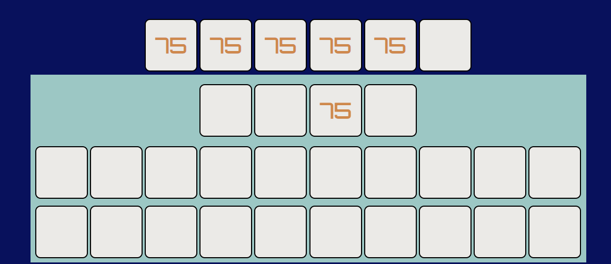

<h1 align="center">Countdown Numbers Game</h1>
<h1 align="center"></h1>

## About

This website is inspired by the popular British television show 'Countdown'. It is a practice version of the numbers round on the show. It's a responsive design that can be played at home or on the go.
## Table of Contents
[User Experience (UX)](#ux)

[Features](#features)

[Debugging](#debugging)

[Technologies Used](#technologies)

[Testing](#testing)

[Deployment](#deployment)

[Known Bugs](#bugs)

[Credits](#credits)

## User Experience (UX)

### User Stories
- #### As any visitor to the website
  1. I want to easily understand the purpose of the website at first glance.
  1. I want the flow of information and interaction feedback to be clear and unambiguous.

- #### As a player who isn't aware of how to play the game
  1. I want the instructions to be obviously placed.
  1. I want the instructions to be easy to understand.
  1. I want the interactions with the website to be intuitive.

- #### As a returning player or one already familiar with how to game works
  1. I want to be able to track my progress.
  1. I want to be able to access the site from any one of my devices.
  1. I want to provide my feedback so that the site can be improved.

### Design
- #### Colour Scheme
  - As the aim of the game can be boiled down to information processing I wanted to make sure that the information was displayed in an unambiguous fashion. Colours with high contrast became a priority. At the same time I wanted to incorporate a shade of blue close to the one that dominates the set of countdown. With these factors in mind I generated a colour palette. The colours used in the website are Black Chocolate (#1D1E18), Bdazzled Blue (#2A5AA7), Duke Blue (#090C9B) and Light Periwinkle (#D3D9E9). There is also a stop button that appears at a certain point during the play of the game so I incorporated Fire Engine Red (#CE2029) to draw the user's attention to that element.
    
    

- #### Typography
  - The main font used is a sans-serif font called 'Orbitron' with sans-serif as the secondary option. I chose this font as it is remeniscint of a calculator, much like the digital numeric font used on the show.

  - The heading font used was 'Oswald' with sans-serif as a fallback. This font is robust and well-suited towards the header of the website. The heading must be immediately obvious to and make an impression on the user.

  - The body font I used for other text was 'Raleway', again with sans-serif as the backup font. This font contrasts nicely with Oswald and has a sleek design.

    

## Features

### Existing Features

- [x] **Detailed Instructions** - imperative for new users who are unfamiliar with the rules.
  - I designed this as a dropdown to maintain the structural integrity of the page. I especially wanted to avoid having a vertical scroll bar for the game as it would be unwieldly for the user.
  - At the same time I realised that the instructions should be immediately obvious to any new visitors to the website so I placed it directly below the main heading.
- [x] **Interactive Cards** - allows user to simulate choosing each individual card (screens above 1024px width).
  - You flip the card, just as you would in the real game, and your number is added to the board.
  - On mobile there are two cards, each representing either large or small numbers, which the user can choose from. Once the card is clicked a random number from that pool is added to the board.
- [x] **Target Number Generator** - once all 6 cards have been drawn the 3 slots start 'spinning'.
  - The inner text of each slot is replaced every 0.1 seconds according to a formula.
  - Slot 1 can a number from 1 to 9. Slots 2 and 3 can yield any number from 0 to 9.
  - As soon as the numbers are being randomised, a stop button becomes available to the user. I incorporated both this feature and the aforementioned card flipping so the gameplay would not be overly passive and boring to the user.
- [x] **Self-Generating Input Rows**
  - I made the input rows with the aim of keeping the flow as clean and orderly as possible. Only the next row needed will be generated.
  - Previous rows are frozen in place so that the user can review their last couple of calculations. As a practice game, features that allow the user to look back over thier mistakes are important.
  - To minimize clutter, once there are 3 input rows on the page, the oldest one will be removed to make room for the newest.
  - Upon calculation of a row the numbers used are removed from the display cards and the result is added to them. This number of display cards is also reduced by 1 each time.
- [x] **Scoreboard**
  - Keeps track of the users metrics for their current play session.
  - Since users will want to see how they are doing, the scoreboard stores how many total points they have earned, how many times they got into each scoring range, and how many attempts they have made so far.
  - Currently only available on desktops.
- [x] **Responsiveness**
  - The game is responsive across all screen sizes.
  - While not every feature is available on smaller screen sizes, substitutions and the next feature to be implemented will bring the mobile experience almost to par with the full size desktop version. Having all 24 cards available for selection on a small screen is not really feasible.

### Future Features
- [ ] Modal scoreboard with toggle button found beside the instructions dropdown for devices of smaller screen widths.
- [ ] Timer feature so that you can test if you'd be able to perform under pressure like on the show itself.
- [ ] Leaderboard so people can compete on the website.
- [ ] User feedback section.
- [ ] Practice modes for the other gameshow segments - the classic letter jumble game and the 9 letter conundrum round.

## Debugging

Throughout the development of this project there were bugs and issues that needed to be resolved. Here are a few of the standout problems I faced.

- **Card Backs Iteration**
  - Wrote the function to assign the card backs their own specific ID and then append each back to a card.
  - Ended up getting an array of all the cards where each individual card had 25 children as all 24 distinct backs were being appended to them all.
  - Solved through the correct use of the .cloneNode() method.

      ![Card Back Bug]./assets/images/readme-images/card-back-array-bug.png)
      ![Card Back Bug]./assets/images/readme-images/card-back-array-bug1.png)
      ![Card Back Bug]./assets/images/readme-images/card-back-array-bug2.png)

- **User Picks Vertical Alignment**
  - The cards which display the numbers the user has chosen were jumping out of position when I pushed a value to them.
  - Changing the vertical alignment of the elements so that they all lined up with the top of the tallest element solved this problem.
  - Since they were all the same height this resulted in them staying aligned.

      

- **Spinner Function**
  - Tried to implement a function to change the innerHTML of the spinner slots using a setInterval method.
  - This would not work as I could not effect the function from an external source.
  - After looking into recursive functions I came up with a solution.
  - The new function changes the innerHTML and then waits 0.1s before calling itself again. The if statement in the equation checks if the spin variable is true so when I click the stop button, and change that variable's value to false, the spin function stops itself at the beginning of the next loop.

      
      

- **Prevent Picking the Same Card Twice**
  - Prevented this issue by swapping the class that the event listeners are tied to to a class with no CSS rules (The available class).
  - This allowed me to add a function removing the class 'available' from a card when picked so that the user can't keep clicking the same card to fill thier picks with it.

      

- **Parse Int**
  - Could not get this piece of code to work until I eventually realised that the boolean was false as the array contained string values and by parsing the operands to integer form prior to the conditional, during their declaration, the boolean was resulting in a false and would not proceed.

      

- **Adding When Number Was Not In The Array**
  - Computation function was running despite not having the correct inputs.
  - Fixed by adjusting conditional check from if (userNums.includes(operand1 && operand2)) to if (userNums.includes(operand1) && userNums.includes(operand2)).
  
      

  - At this time I noticed the next bug.

- **Able To Use Same Number Twice In 1 Computation**
  - The user was able to make use of the same number twice in a computation line.
  - Fixed by prefacing the while computing function with the condition that the index of operand1 in the user numbers array cannot equal the index of operand2.

      

- **Able To Divide While Leaving A Remainder**
  - Forgot to predicate the division rule on the premise that the modulo of the operation must be 0.

      

- **Unable To Use Same Value Twice When Valid**
  - The above bug fix caused another bug in the code.
  - If the same value was included twice in the array the function no longer accepted using both as a valid input.
  - I solved this problem by changing my earlier bug fix of comparing the indices of the operands in the array.
  - I instead compared the operands themselves. If they were not equal the function would run as before. I then spliced the value of the first operand from the array and then check if the array still includes operand2. If it does then the same code as before runs. If it does not then the user also gets the invalid choice message.

      

- **Wrong Operand Spliced**
  - I noticed that the splicing methods were removing the wrong operand sometimes.
  - This was because the index values were declared before either splice.
  - Then after the first splice was performed the second operand index variable would be wrong as the elements would have shifted.
  - I solved this by only declaring the second index variable after the first splice had been completed.

      
      

- **Mobile Cards Bug**
  - When I implemented the mobile-friendly cards I found that the calculation funnction was not working.
  - Tracked it down to the fact that my original user numbers array had been passed the inner text values of the cards, rather than the number value.
  - Passed the user numbers array the String(value) of the number chosen by the card and let the function carry on as normal after that.

## Technologies Used

### Languages Used

- [HTML5](https://en.wikipedia.org/wiki/HTML5)
- [CSS3](https://en.wikipedia.org/wiki/Cascading_Style_Sheets)
- [JavaScript](https://www.javascript.com/)

- [Git](https://git-scm.com/) - Git was used for version control.
- [GitPod](https://www.gitpod.io/) - GitPod, through GitHub, hosted the IDE used for the entirity of this project.
- [Github](https://github.com/) - GitHub is used to host the project files and the live website through GitHub Pages.
- [Font Awesome](https://fontawesome.com/) - Font Awesome was to add the chevron to the instructions dropdown.
- [Google Fonts](https://fonts.google.com/) - Google Fonts was used to import 'Orbitron', 'Oswald' and 'Raleway' fonts in the main.css stylesheet.

## Testing

 ### Functionality Testing
 - #### User Selectable Cards
  - Desktop - All cards are correctly assigned a number from the array. There are no duplicates and no undefined values.
  - Mobile - Both cards correctly pull from the appropriate array. The large card will only allow 4 pulls before throwing the appropriate error message to the user.
  - Once selected, the number is properl pushed to the user numbers array and display cards to be used at a later point.
  - Once all 6 cards have been chosen the remaining cards are removed properly.
 - #### Target Number Slots
  - Start spinning automatically once the 6th card has been chosen.
  - The numbers update reguarly every 0.1s to a new random number.
  - The first slot cannot yield a value of 0, which would result in a 2 digit number.
  - The stop button appears and then disappears smoothly.
  - The resulting target number is appropriately stored for later use.
 - #### Input Rows
  - Input rows will only accept numbers that the user has to hand.
  - If the user trys a division operation that leaves a remainder they will be informed that it is not allowed.
  - If the user attempts to use the same number twice when they have only 1 instance of that number they will be throw an explanatory error alert.
  - The user display cards are clickable at this point and will update the empty input boxes from left to right. If for some reason the user has both inputs filled out but wants to change the first one they can delete the value from the input box and then click the correct display card.
  - The operator dropdown is fully functional.
  - When the player clicks the equals button on a row the result is calculated, the used numbers are removed from the display and the resulting number is added to it.
  - Previous input rows are not interactable once the result of the row has been calculated.
  - The oldest input row is removed to maintain the same total page height.
  - The done button, as well as the calculation using the users last 2 available numbers will both compare the last result with the target number. Once this comparison has been made the scoreboard will update and the results modal with the correct message will display.

### CSS3 Jigsaw Validation - Pass
   Results

### HTML5 W3C Validation
- Pass - [Results](https://validator.w3.org/nu/?doc=https%3A%2F%2Fcathalmc-dev.github.io%2Fportfolio-project-2%2F)

### Performance Testing
- Tested using Chrome's Dev Tools - Lighthouse while set to both desktop and mobile.
      
      
      
- Also tested using webpagetest.org. [Results] (https://www.webpagetest.org/result/210626_BiDcPJ_2cf14a49b1ddcb7d7eaa569b2d79342a/)

      

## Deployment

### Publishing
This website was published using the [GitHub Pages](https://pages.github.com/) service.
This can be achieved as follows:
1. Go to the GutHub repository you wish to publish.
2. In the upper tabs, click on Settings.
3. Click on the second last tab in the list that appears on the left.
4. Under the Source section, click the dropdown and select the 'master' branch.
5. The page will reload and you will be presented with a link to your deployed page.
6. It will take a few minutes for the live version of your website to be functional, have patience!

    

## Known Bugs

- **Invalid Input Still Advances Game**
  - After introducing the feature where a user can click on one of the available cards to quick input it, a new bug arose.
  - If the user clicks the same card twice they can click calculate and the game will proceed illegaly.
  - The front-end of the website does not give any indication that this has happened.
  - Any further calculations become skewed at this point.
  - Thus far I have been unable to track down the cause of this bug.

- **Mobile Keyboard Moving Done Button**
  - On mobile, while in the input stage, if the user trys to type in an input box their keyboard will displace the done button.

## Credits

### Content

- All code, except where otherwise specified, was written by me - Cathal McDermott
- Colour scheme was found with the help of [coolors.co](https://coolors.co/)

### Media

- Favicon:
  - 
Icons made by <a href="https://www.freepik.com" title="Freepik">Freepik</a> from <a href="https://www.flaticon.com/" title="Flaticon">www.flaticon.com</a>

  ### Acknowledgements

- The project itself is based on the gameshow [Countdown](https://en.wikipedia.org/wiki/Countdown_(game_show))
- Thanks to my mentor, Maranatha Ilesanmi. Javascript still intimidated me before my first mentor session but he helped talk me through that.

